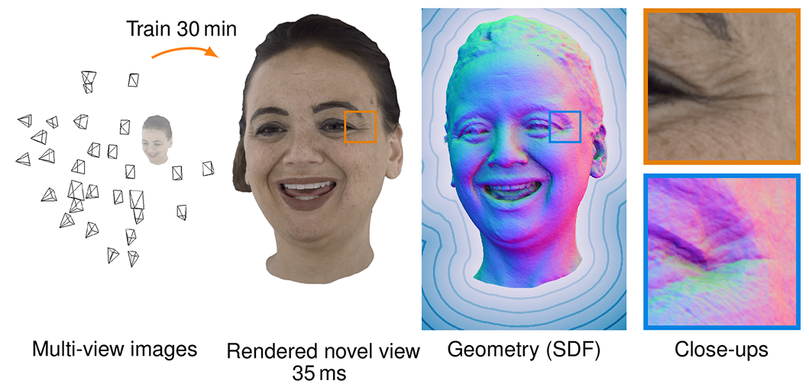
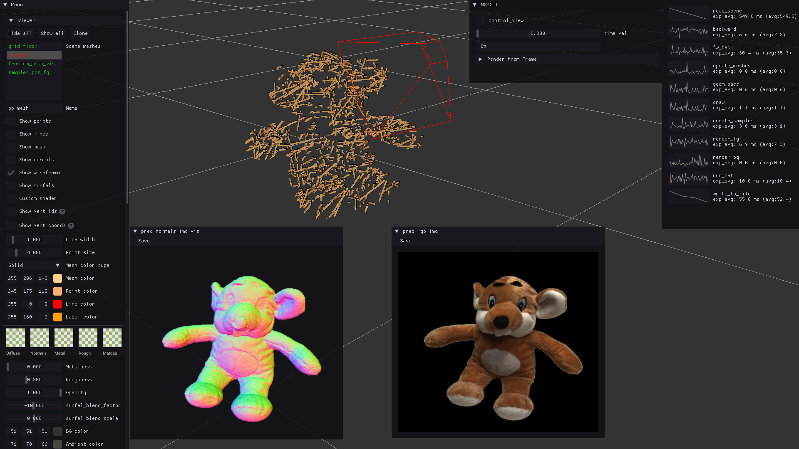
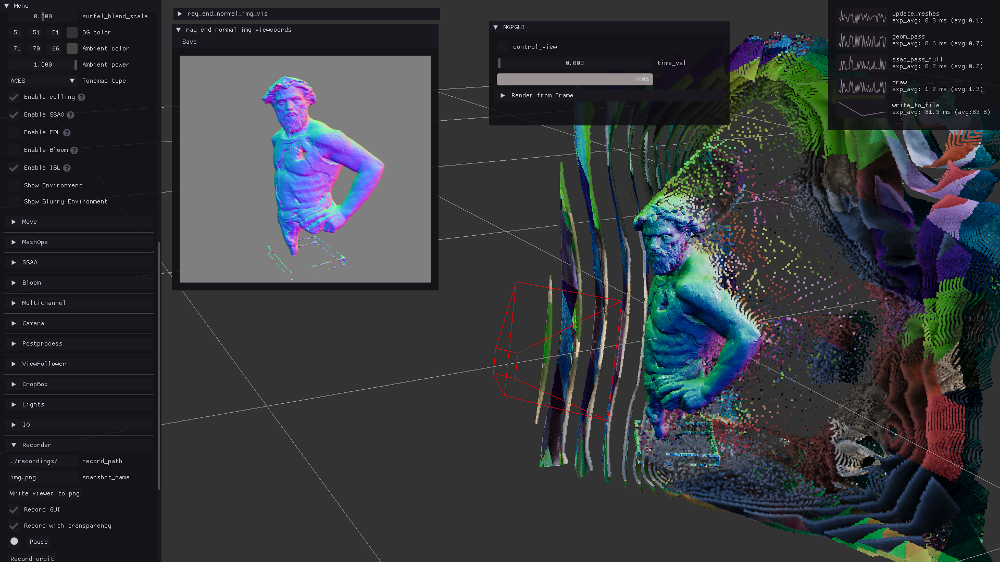
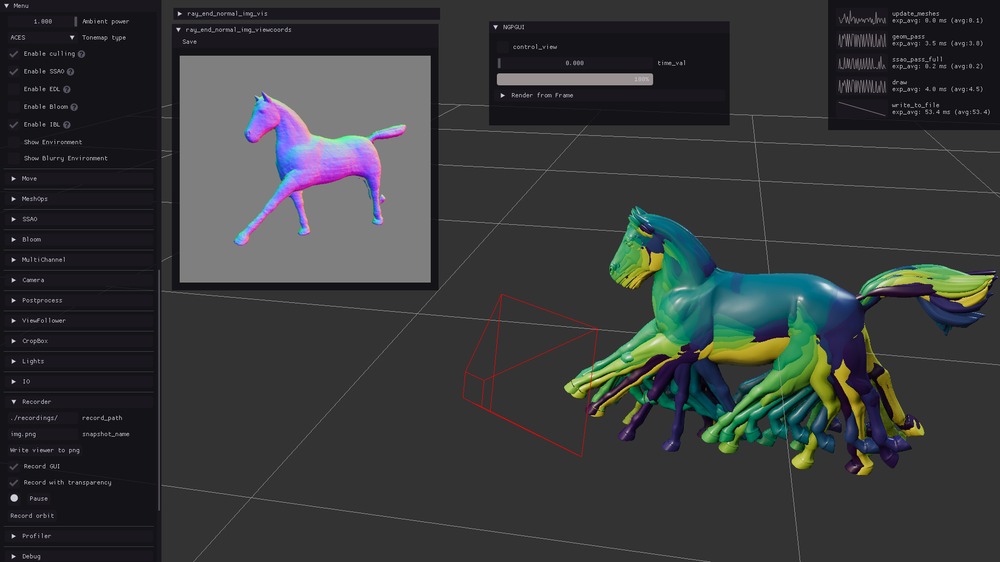
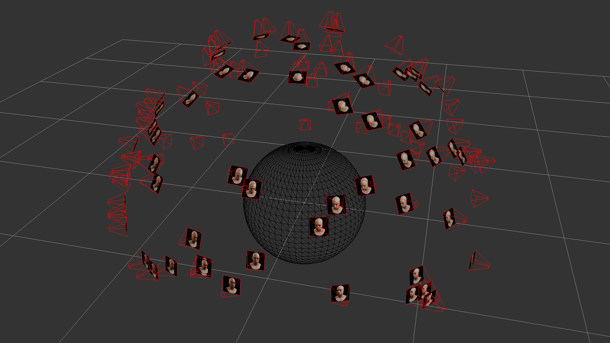

# PermutoSDF


### [Project Page](https://radualexandru.github.io/permuto_sdf) | [Paper](https://arxiv.org/abs/2211.12562) | [Data](https://drive.google.com/drive/folders/1IcCtveUyQ4sHwVpdyjLt28rAdHYFHmtT?usp=share_link)

[PermutoSDF: Fast Multi-View Reconstruction with Implicit Surfaces using Permutohedral Lattices](https://radualexandru.github.io/permuto_sdf)
<br>
 [Radu Alexandru Rosu](https://radualexandru.github.io/),
 [Sven Behnke](https://www.ais.uni-bonn.de/behnke/)
 <br>
 University of Bonn, Autonomous Intelligent Systems


<p align="middle">
  
</p>

PermutoSDF is a system capable of recovering highly detailed 3D reconstructions given only 2D images with poses. We propose to use a hashed [permutohedral encoding] to ensure fast training and a novel RGB regularizer to encourage the network to predict high-frequency geometric detail. 
We model the scene as two neural networks that predict an SDF and a color field. Volume rendering is used to train the two networks end-to-end. After training we can switch to sphere tracing and render at interactive speeds.


# Install 

Since PermutoSDF requires PyTorch to be installed with CXX_ABI=1, it's best to use the provided dockerfile:
```sh
$ git clone --recursive https://github.com/RaduAlexandru/permuto_sdf
$ cd permuto_sdf/docker
$ ./build.sh
$ ./run.sh
```
This will build a docker image containing almost everything that is needed.  <br>

If you encounter any issues like `docker: Error response from daemon: could not select device driver "" with capabilities: [[gpu]].`, try running the script `./permuto_sdf/docker/nvidia-container-runtime-script.sh`<br>

If you encounter issues like `unexpected status: 401 Unauthorized`, please create an account on the [NGC container registry](https://docs.nvidia.com/deeplearning/frameworks/user-guide/index.html#accessing_registry), obtain an API key as described [here](https://docs.nvidia.com/ngc/gpu-cloud/ngc-overview/index.html#generating-api-key) and finally login as shown [here](https://docs.nvidia.com/deeplearning/frameworks/user-guide/index.html#accessing_registry)


PermutoSDF also depends on [EasyPBR], [DataLoaders] and [permutohedral_encoding] packages. Once you are inside the docker container (after running ./docker/run.sh) they can be easily installed with the following lines:
```sh
$ git clone --recursive https://github.com/RaduAlexandru/easy_pbr
$ cd easy_pbr && make && cd ..
$ git clone --recursive https://github.com/RaduAlexandru/data_loaders  
$ cd data_loaders && make && cd ..
$ git clone --recursive https://github.com/RaduAlexandru/permutohedral_encoding
$ cd permutohedral_encoding && make && cd ..
```
We use [EasyPBR] for visualizing locally the training progress, [DataLoaders] for loading various datasets and [permutohedral_encoding] as a self-contained package for performing hash-based encoding using the permutohedral lattice.

After they are installed, one can install permuto_sdf package using 
```sh
$ git clone --recursive https://github.com/RaduAlexandru/permuto_sdf
$ cd permuto_sdf && make 
```

Optionally you can also install [APEX] for slightly faster training. PermutoSDF will automatically detect that it is installed and used their FusedAdam for optimizing.


# Data

For training and experiments we use the the [Multiface], [DTU] and [BlendedMVS] datasets. \
We also provide our own EasyPBR-based dataset containing the synthetic head. \
All the data used in the paper in a format that is readable by our scripts can be found [here](https://drive.google.com/drive/folders/1IcCtveUyQ4sHwVpdyjLt28rAdHYFHmtT?usp=share_link):

Unzip all the files datasets inside the permuto_sdf_data folder so you end up with a structure like:

<!-- TODO imgs of the dataset maybe? -->

<!-- TODO modify the paths to point towards your data  -->


```bash
    permuto_sdf_data
    ├── data_BlendedMVS
    │   ├── bmvs_bear
    │   ├── bmvs_clock
    │   └── ...
    ├── data_DTU
    │   ├── dtu_scan24
    │   ├── dtu_scan37
    │   └── ...
    ├── easy_pbr_renders
    │   ├── head
    ├── horse_gallop
```

Finally you have to open `permuto_sdf_py/paths/data_paths.py` and add another line for where to find the path permuto_sdf_data on your computer. 
So the new line will be something of the form `comp_3": "<THE_PATH_WHERE_YOU_DOWNLOADED_THE_DATA>/permuto_sdf_data",`
Now when calling the training routines from the next sections you can add the flag `--comp_name comp_3` do indicate that you are going to use this path


# Train

<!-- ## Train individual scenes  -->
<!-- We provide script to train individual scenes using the permuto_sdf pipeline  -->

<!-- - #### Train PermutoSDF on a certain scene -->
## Train PermutoSDF on a certain scene
```Shell
./permuto_sdf_py/train_permuto_sdf.py \
--dataset dtu \
--scene dtu_scan24 \
--comp_name comp_3 \
--exp_info default
```
The training will start and on the dtu_scan24 scene and a viewer will appear where you can inspect the training progress.
Other options for this script are:
```Shell
--no_viewer  #disables the OpenGL viewer so you can run the script on a headless machine
--low_res    #loads the images at lower resolution. Useful on machines with lower than 6GB of VRAM
--with_mask  #Uses the binary mask from DTU or BlendedMVS dataset to ignore the background
```
Additionally you can enable saving of the checkpoints and other logging options by setting to true the flag `save_checkpoint` in `./config/train_permuto_sdf.cfg`.\
At any point during training you can click inside the GUI on "control_view" in order to move the camera around the scene. \


<!-- - #### Train SDF from a known mesh -->
## Train SDF from a known mesh
```Shell
./permuto_sdf_py/train_sdf_from_mesh.py \
```
It will load a high-resolution mesh from EasyPBR and trains only the SDF network. \


<!-- - #### Train 4D SDF -->
## Train 4D SDF
```Shell
./permuto_sdf_py/train_4d_sdf.py \
--comp_name comp_3
```
It will load various meshes from an animation and it will learn the 4D (3D+time) geometry. Using the viewer you can modify the time value so you can sweep through the time-dimension of the model. \


## Train NeRF
```Shell
./permuto_sdf_py/train_nerf.py \
--dataset dtu \
--scene dtu_scan24 \
--comp_name comp_3 \
--exp_info default
```
We also provide an example which trains a NeRF-like model using the permutohedral lattice. 


## Serial Training
It is common to want to train on all the objects from the DTU dataset and instead of running various times the `train_permutosdf.py` script we provide a script to run through all the object from the dataset one-by-one so you can leave this script running overnight. 

```Shell
./permuto_sdf_py/experiments/serial_training/serial_train.py \
--dataset dtu \
--with_mask \
--comp_name comp_3 \ 
--exp_info experiment_name
```


# Results

We gather the resulting novel-view synthesis images and meshes generated by PermutoSDF under the results folder in [here](https://drive.google.com/drive/folders/1IcCtveUyQ4sHwVpdyjLt28rAdHYFHmtT?usp=share_link).\
We also provide checkpoints for all the objects in the DTU dataset which can be found under the same link. \
The results can be regenerated from the checkpoints by using the scripts in `create_my_images.py` and `create_my_meshes.py` from the folder `./permuto_sdf_py/experiments/evaluation`. Afterwards the `evaluate_psnr.py` and `evaluate_chamfer_distance.py` should report the corresponding metrics.

# Run on your custom dataset

If you already have images and camera parameters that you computed from structure from motion packages like Colmap:

We provide a small example of creating a custom dataset with [./permuto_sdf_py/experiments/run_custom_dataset/run_custom_dataset.py](./permuto_sdf_py/experiments/run_custom_dataset/run_custom_dataset.py). It currently loads from the EasyPBR dataset but it should be easily modifiable for your purposes. For this you would need images together with camera intrinsics and extrinsics. The script shows how to load the images and the format required for the camera parameters. Finally you need to scale and translate your scene so that your object of interest lies within the bounding sphere of radius 0.5. You have to modify this manually for your current dataset using `SCENE_SCALE` and `SCENE_TRANSLATION` as it's difficult to provide a reliable and automatic way of selecting these parameters. When you run the `run_custom_dataset.py` script it will also print the scale and the origin of all the cameras you defined.  Note that you don't need to get your cameras to be within the bounding sphere, only the object you want reconstructed needs to be contained within it, the cameras can be outside of the sphere.

Running the script should show something like this where the bounding sphere is in the center and in red are the frustums of all the cameras. \



# License
PermutoSDF is provided under the terms of the MIT license (see LICENSE). 


# Citation
```
@inproceedings{rosu2023permutosdf,
    title={PermutoSDF: Fast Multi-View Reconstruction with 
            Implicit Surfaces using Permutohedral Lattices  },
    author={Radu Alexandru Rosu and Sven Behnke},
    booktitle = {IEEE/CVF Conference on Computer Vision and Pattern Recognition (CVPR)},
    year={2023}
}
```


[permutohedral encoding]: <https://github.com/RaduAlexandru/permutohedral_encoding>
[permutohedral_encoding]: <https://github.com/RaduAlexandru/permutohedral_encoding>
[EasyPBR]: <https://github.com/RaduAlexandru/easy_pbr>
[DataLoaders]: <https://github.com/RaduAlexandru/data_loaders>
[Multiface]: <https://github.com/facebookresearch/multiface>
[DTU]: <https://roboimagedata.compute.dtu.dk/?page_id=36>
[BlendedMVS]: <https://github.com/YoYo000/BlendedMVS>
[APEX]: <https://github.com/NVIDIA/apex>